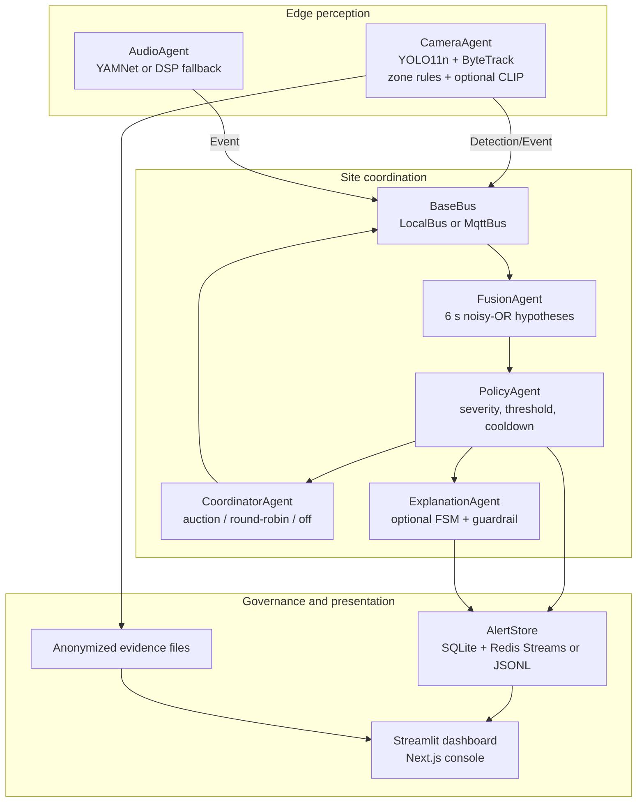
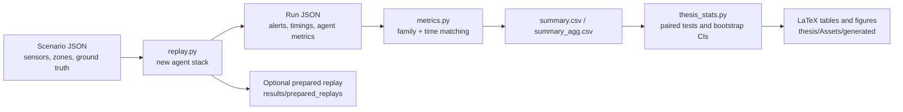

# AURA-MAS: Current Repository Overview

> **Scope and status.** This is a code-grounded snapshot of the active
> `multi-zone-demo-scenarios` working tree, inspected on 2026-08-28. It is a
> companion to, not a replacement for, [README.md](README.md), which remains
> the setup and quick-start document. The prior audit in
> `research/reports/research-report-v1/` was read first and re-checked against
> the current tree. Claims below cite the files that implement or substantiate
> them; `[uncertain]` means the repository does not provide enough evidence.

## Table of contents

- [Snapshot](#snapshot)
- [What runs today](#what-runs-today)
- [System architecture](#system-architecture)
- [AI Research Engineer assessment](#ai-research-engineer-assessment)
- [Software Architect assessment](#software-architect-assessment)
- [Thesis Research Advisor assessment](#thesis-research-advisor-assessment)
- [Open questions and next steps](#open-questions-and-next-steps)

## Snapshot

- **Repository role:** AURA-MAS is a replay-driven, privacy-oriented
  surveillance prototype. It combines camera and audio agents, fusion,
  optional verification, deterministic policy decisions, optional LLM
  explanations, and two operator UIs. The authoritative Python package is
  `aura_mas/`; the authoritative thesis source is `thesis/`.
- **Current branch:** `multi-zone-demo-scenarios`, four commits ahead of
  `main`, with uncommitted Avenue importer changes and untracked Avenue
  scenarios/data. The branch adds a prepared, multi-zone demonstration
  catalogue and makes manifest-declared `fov_overlap` reach the auction task
  (`aura_mas/scenarios/replay.py`, `aura_mas/agents/coordinator_agent.py`).
  These new scenarios are not part of the reported 373-run campaign.
- **Inputs and artefacts:** 70 JSON scenario manifests currently resolve to
  local data paths. The reported experiment artefacts are the 373 runs in
  `results/run_*.json`, `results/summary.csv`, `results/summary_agg.csv`, and
  `results/evaluation_campaign_v2_notes.md`. Prepared replay/demo artefacts
  are separately stored in `results/prepared_replays/`.
- **Verification:** `.venv/bin/python -m pytest aura_mas/tests -q` passes
  **68 tests**. The host Python cannot collect the full suite because it lacks
  `opentelemetry` and `python-statemachine`, despite both being declared in
  `requirements.txt`; this is an environment-installation issue, not a pass
  on the host interpreter.
- **Important correction to the prior audit:** the current `thesis/Chapters/
  chapter6.tex` now reports the 373-run negative result and its statistical
  qualifications. The old single-run positive narrative remains only in
  historical backup files such as `thesis/main.bak0` and
  `thesis/Chapters/chapter6.bak0`.

## What runs today

`aura_mas/scenarios/replay.py` instantiates the core pipeline from a scenario
manifest. It supports `centralized`, `mas-nocoord`, `mas-rules`,
`mas-auction`, and the explicitly non-headline `mas-auction-bandit` mode. The
campaign driver (`aura_mas/scripts/run_campaign.py`) exercises only the first
four, always with `--bus local`.

| Capability | Evidence | Current evidence level |
| --- | --- | --- |
| Video detection/tracking and zone rules | `aura_mas/agents/camera_agent.py` | Implemented; replay-tested. YOLO11n/ByteTrack are lazy runtime dependencies. |
| Audio event detection | `aura_mas/agents/audio_agent.py`, `aura_mas/scripts/fetch_yamnet.py` | Implemented; YAMNet is optional; DSP fallback produces generic labels. |
| Late fusion and deterministic alerting | `aura_mas/agents/fusion_agent.py`, `policy_agent.py` | Implemented and exercised in campaign. |
| Contract-Net-style verification | `coordinator_agent.py`, `camera_agent.py` | Implemented. Historic campaign did not populate its overlap term; new demo manifests do. |
| MQTT, Redis, SQLite | `aura_mas/core/bus.py`, `core/db.py`, `docker-compose.yml` | Implemented as optional transports/stores; not evaluated in the 373-run campaign. |
| LLM/VLM explanation and telemetry | `agents/explanation_agent.py`, `explanation_fsm.py`, `telemetry.py` | Implemented and unit-tested; campaign used fallback templates, with one recorded local-model guardrail rejection (`data/otel_spans.jsonl`). |
| Streamlit and Next.js consoles | `aura_mas/dashboard/app.py`, `frontend/src/` | Implemented; UI screenshots/prepared replay assets are demonstrators, not experiment evidence. |
| Live camera relay | `aura_mas/streaming/live_cameras.py`, `stream_server.py`, `config/live_cameras.example.json` | Implemented as an RTSP/HTTP MJPEG relay; no end-to-end live deployment evidence found. |
| Experimental extensions | `core/bandit.py`, `alert_priority.py`, `contextual.py` | Present but not validated research results; see their own limitation notes. |

## System architecture



The edge-to-policy path is implemented in `camera_agent.py`, `audio_agent.py`,
`fusion_agent.py`, `coordinator_agent.py`, `policy_agent.py`, and
`core/bus.py`. The diagram intentionally shows the explanation agent
downstream of policy: it cannot authorize an alert.

```mermaid
sequenceDiagram
  participant C as CameraAgent
  participant A as AudioAgent
  participant B as Bus
  participant F as FusionAgent
  participant P as PolicyAgent
  participant K as CoordinatorAgent
  participant S as AlertStore
  C->>B: Event (video, optional anonymized evidence)
  A->>B: Event (audio)
  B->>F: site/events
  F->>P: Hypothesis after window closes
  alt confidence in gray zone and more than one camera
    P->>K: request_verification(hypothesis)
    K->>B: task announcement, including manifest overlap map
    B->>C: task; eligible cameras publish bids
    C->>B: bid
    K->>B: award
    B->>C: winning camera verifies latest frame
    C->>B: verification result
    K-->>P: verified/refuted result
  end
  P->>S: alert or suppression audit record
  opt --llm enabled and alert accepted
    P->>S: alert with guarded explanation or fallback template
  end
```

This is the actual topic-mediated flow in `core/bus.py` and the callbacks in
the agents. On `LocalBus`, callbacks are synchronous Python calls
(`LocalBus.publish`), so its measured message counts are not network costs.



Fresh-subprocess orchestration is in `aura_mas/scripts/run_campaign.py`; the
reported grid and exclusions are documented in
`results/evaluation_campaign_v2_notes.md`. `prepared_replays` are a separate
presentation/search pipeline, not additional campaign observations.

## AI Research Engineer assessment

### Model and technique inventory

The system does not train perception models. `CameraAgent` lazily loads
Ultralytics YOLO11n and uses its ByteTrack integration; it implements
intrusion, loitering, abandoned-object, occupancy, wrong-direction,
person-down, and rapid-movement rules when manifest keys enable them
(`camera_agent.py`). Optional CLIP ViT-B/32 uses fixed prompts for anomaly
scoring. `results/clip_anomaly_calibration_notes.md` records AUC **0.308**;
the component exists but should not be described as a validated anomaly
detector.

`AudioAgent` uses locally fetched YAMNet when available, mapping AudioSet
classes to surveillance event names, and otherwise a rolling energy/spectral
flatness z-score detector (`audio_agent.py`). The DSP comparison is not a fair
model-quality ablation: it emits `audio_anomaly`, which the family matcher
does not match to class-specific audio ground truth. This is explicitly shown
in `results/evaluation_campaign_v2_notes.md`.

Fusion is a reliability-weighted noisy-OR with fixed video/audio weights and
two `+0.05` bonuses (`fusion_agent.py`). Its monotonicity is a code property,
not a calibrated probability claim. Repeated observations from the same
camera are treated as independent; `results/cross_modal_fusion_audit.md` and
`thesis/Chapters/chapter6.tex` document saturation and rare creditable
cross-modal alerts.

### Evaluation as built

The headline campaign has 373 successful local-bus replays: nine scenarios,
four modes, five repetitions with audio-visual and eligible vision-only runs,
plus a three-repetition DSP subset. `metrics.py` matches an alert to a ground
truth item by **event family** and a fixed ±5-second interval, greedily and
one-to-one. `thesis_stats.py` then performs paired Wilcoxon tests,
Holm--Bonferroni correction, Cliff's delta, and bootstrap intervals; current
Chapter 6 reports that no architecture pair is significant after correction.

The correct reported point-estimate ordering is MAS-nocoord 0.577,
centralized 0.519, MAS-rules 0.490, and MAS-auction 0.452, as reproduced in
`results/summary_agg.csv` and stated in `thesis/Chapters/chapter6.tex`.
Thus the auction ranks last on mean F1 in that corpus; the thesis source no
longer claims it ranks first.

### Validity limits and confounds

- `replay.py` uses `realtime = mode != "centralized"`; centralized sources
  are sequential and unpaced while MAS sources are concurrent and paced. Its
  time-to-alert comparison does not isolate architecture.
- The fusion window, auction wait, policy cooldown, detection thresholds,
  reliability weights, and scoring tolerance are mostly hard-coded defaults
  across agents and metrics. There is no held-out calibration or parameter
  sensitivity study.
- Family-level greedy matching can conflate distinct events in one family and
  under-credit a fused alert. The combined audio/video case is documented in
  `results/evaluation_campaign_v2_notes.md`.
- False-alerts-per-hour extrapolates counts from short clips; Chapter 6 now
  acknowledges its degeneracy. No component mAP, tracking HOTA/IDF1, real
  transport latency, resource envelope, or live-deployment reliability study
  is provided.
- Campaign code has no seed argument or per-run commit/environment capture
  (`run_campaign.py`, `replay.py`); repetitions observed real variance but do
  not make the experiment fully reproducible.
- The real LLM path did not run in the campaign. The guardrail has structural
  tests and one local-model rejection, not a generative-model evaluation at
  meaningful sample size (`results/explanation_judge_notes.md`).

## Software Architect assessment

### Component map and boundaries

The package has clear operational seams: schemas/transports/persistence in
`core/`; independent message-driven agents in `agents/`; replay/evaluation in
`scenarios/` and `eval/`; presentation adapters in `dashboard/`, `streaming/`,
and `frontend/`. `AlertStore` now also writes SQLite (`core/db.py`) while
retaining Redis-or-JSONL fallback. The Next.js application reads files,
Redis, and MQTT through server routes; its prepared replay catalogue is driven
by `results/prepared_replays/`, not live inference.

The principal coupling points are the unversioned `Detection`, `Event`, and
`Alert` dataclasses (`core/bus.py`), scenario JSON shape, relative paths, and
the duplicated TypeScript representation in `frontend/src/lib/types.ts`.
`Event.from_json()` passes JSON fields directly to the dataclass, so schema
evolution can break archived artefacts. `replay.py` monkey-patches
`AlertStore.append` to measure timing, meaning the evaluated path is not
identical to ordinary persistence.

### Reliability and scale concerns

- `LocalBus` synchronously invokes subscribers. In a local auction the fixed
  one-second bid sleep is dead latency and a verification can run inside the
  publisher call stack. MQTT semantics, queueing, retries, QoS effects,
  bandwidth, and Redis durability are therefore unevaluated.
- The coordinator blocks per verification (`bid_window` then up to three
  seconds). `FusionAgent` is windowed and policy is invoked synchronously;
  there is no back-pressure, task queue, cancellation, retry policy, or
  measured multi-site scaling behaviour.
- `ZoneRuleEngine` keeps per-track state without eviction, a continuous-run
  memory-growth risk (`camera_agent.py`). The winner verifies its current
  last frame, not an incident-time frame; its predicate is person-centric,
  which is weak evidence for audio or object hypotheses.
- MQTT and Redis in `docker-compose.yml` are developer defaults, not a
  secured deployment. The live camera relay protects configured credentials
  in logs (`live_cameras.py`) but lacks end-to-end authentication/authorization
  evidence. Privacy anonymization is structural, while its re-identification
  resistance is unmeasured (`core/privacy.py`).
- The frontend contains claims not backed by the backend: its Copilot route
  calls the audit log “cryptographically timestamped” and describes online
  reinforcement as active (`frontend/src/app/api/copilot/route.ts`), whereas
  the audit is append-only by convention and `site/feedback` handling only
  updates an in-memory coordinator bandit. The thesis correctly qualifies the
  audit log in `chapter4.tex` and `chapter7.tex`.

### New/unused paths

The branch's multi-zone manifests declare overlap maps and exercise newer
rules through prepared replay/demo runs, but there is no corresponding
multi-zone campaign aggregate. `mas-auction-bandit` trains/updates a small
LinUCB model against its own verification outcome (`core/bandit.py`,
`scripts/train_auction_bandit.py`); `results/auction_bandit_notes.md`
correctly labels it a toy proof of concept with no held-out validation.
Similarly, `alert_priority.py` trains a logistic model from alert labels
derived using the same family/time heuristic used for evaluation, and it is
loaded only when `--priority-model` is passed. VLM context (`contextual.py`),
LLM-as-judge (`eval/llm_judge.py`), live cameras, and the Next.js search and
copilot are optional/demo paths, not production-evaluated control paths.

## Thesis Research Advisor assessment

### Contribution status

| Claimed contribution | Status now | Evidence and defence implication |
| --- | --- | --- |
| **C1: hierarchical MAS, schemas, MQTT/Redis substrate** | **Partially implemented** | Six agent classes plus console, schemas, LocalBus/MqttBus and Redis/SQLite/JSONL stores exist (`agents/`, `core/bus.py`, `core/db.py`). The campaign used LocalBus and disabled Redis in `replay.py`; transport scalability/reliability claims are unsupported. |
| **C2: auction-based active verification** | **Partially implemented; performance claim unsupported** | Contract-Net flow and bidding exist (`coordinator_agent.py`, `camera_agent.py`). All 373 headline runs predate populated overlap maps, so the intended field-of-view utility term was inert. The current branch fixes the data path for new demos, but has no comparable experiment. Auction was lowest by mean F1 and non-significant after correction. |
| **C3: multimodal noisy-OR late fusion** | **Implemented; effectiveness partially supported** | Formula and monotonicity are implemented (`fusion_agent.py`) and audio/video can enter a shared hypothesis. But repeated dependent evidence saturates the score and the metric under-credits composite alerts; no fusion-rule ablation establishes that noisy-OR or its bonuses improve outcomes. |
| **C4: decision-decoupled, guarded explanation** | **Implemented structurally; empirically unsupported** | Policy owns alert creation and the explanation FSM/guardrail/fallback are real (`policy_agent.py`, `explanation_agent.py`, `explanation_fsm.py`). Campaign outputs are templates; n=1 local generative rejection and unit tests do not establish real-model grounding or usefulness. |
| **C5: reproducible system-level evaluation and four-way ablation** | **Implemented, with important limits** | Scenario runner, subprocess driver, preserved runs, aggregation and inferential scripts exist (`replay.py`, `run_campaign.py`, `metrics.py`, `thesis_stats.py`). It is the best-supported contribution, but is limited by pacing, matching, short-duration FA/h, no seeds/environment capture, and a small heterogeneous corpus. |

### What a committee is likely to probe

1. Why call the auction superior when its reported mean F1 is lowest, and why
   should an untested multi-zone overlap fix change that conclusion?
2. How is centralized-versus-MAS latency attributable to architecture when
   the baseline is unpaced and sequential (`replay.py`)?
3. Why does a family-level, greedy ±5-second matcher count a cross-modal
   alert correctly, and what is an operationally meaningful false-alert rate
   for seconds-long clips?
4. Which exact evidence establishes multimodal corroboration rather than
   confidence saturation from repeated events from one sensor?
5. Where is the LLM explanation experiment, its prompt-injection test, and
   a human or independent-model quality assessment? Structural prevention is
   not the same as empirical safety.
6. Which results used MQTT/Redis, what was measured in bytes/latency, and how
   are broker access, audit integrity, and raw-frame egress secured?
7. What separates a model trained on labels generated from the evaluation
   heuristic (`alert_priority.py`) or a self-play bandit from a valid learned
   contribution?
8. Which current branch/commit produced the thesis PDF and 373-run artefacts?
   The working tree contains uncommitted Avenue work and newer demo features,
   so this provenance is presently `[uncertain]` per run.

## Open questions and next steps

1. **Create a clean, versioned multi-zone experiment before claiming C2 is
   repaired.** Run auction/rules/no-coordination with unequal, manifest
   `fov_overlap` values, record the commit/config/seed, and compare against a
   paced centralized control. Do not fold these runs into the 373-run table.
2. **Fix the evaluation construct before collecting more headline F1.** Add
   exact-event and optimal one-to-one matching, distinguish detection from
   alert latency, and replace short-clip FA/h with raw false-positive counts
   or sufficiently long negative footage (`eval/metrics.py`).
3. **Make campaign runs attributable.** Add subprocess seed control, git
   dirty/commit hash, resolved manifest/config hashes, package versions, and
   hardware metadata; make resume logic reject an artefact from another
   code/config state (`run_campaign.py`).
4. **Evaluate C4 against real generated output.** Use the existing isolated
   `generate_judge_pilot_explanations.py` workflow, then report guardrail
   rejection causes, fallback rate, adversarial event-text injection results,
   and a small independent/human usefulness assessment.
5. **Measure the advertised coordination substrate.** Execute a bounded MQTT
   and Redis run with authenticated broker configuration; record bytes,
   end-to-end latency, delivery failures, and recovery behaviour rather than
   LocalBus function-call counts.
6. **Separate demo features from research claims.** Mark prepared replays,
   bandit, alert-priority model, VLM context, live streams, and Next.js
   copilot as demos until they have independent tests and data. Correct the
   frontend copilot's cryptographic-audit/RLOF wording.
7. **Harden continuous operation.** Add track-state eviction, event-time
   frame buffers and event-specific verification predicates; then test
   long-running memory and multi-camera load.
8. **Remove stale setup ambiguity.** Either provide the README-referenced
   `requirements-full.txt` or remove the reference; ensure the documented
   default interpreter is the tested `.venv`, and add CI that installs
   `requirements.txt` before running all 68 tests.
