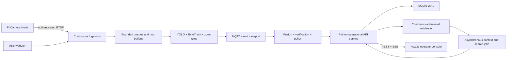

# Live Monitoring and Defensible Demonstration Specification

**Status:** software design accepted; hardware prerequisites Q27–Q29 parked  
**Date:** 2026-08-28  
**Scope:** upgrade AURA-MAS from a replay-led prototype into a hybrid live and reproducible demonstration without overstating production readiness or research evidence

## 1. Outcome

AURA-MAS will support one attributable Live Monitoring Session with two simultaneous physical camera views, durable operator workflow, dynamic zone policies, bounded incident recordings, explicit health degradation, contextual incident retrieval, and measured performance. Prepared Replays remain a separate, visibly labelled evidence track for repeatability and unsafe scenarios.

The defense claim is limited to a research prototype that demonstrates continuous local monitoring. It is not a production-ready home-security product, a general open-world anomaly detector, or evidence that every implemented extension improves detection quality.

## 2. Demonstration topology

| Component | Role | Planned identifier |
| --- | --- | --- |
| Raspberry Pi 5 + Camera Module 2 | Remote live Camera Node; capture, encode, stream, health | `cam_entry_pi` |
| HP HD laptop webcam (`/dev/video0`) | Local live verification camera | `cam_verifier_usb` |
| Laptop, Intel i5-1135G7, 32 GB RAM, CPU-only | Ingestion, perception, agents, persistence, API, UI, context jobs | `control_laptop` |
| Phone camera | Contingency or optional third source only | not required |

The defense includes one overlapping-view trial in which the Pi camera and USB webcam observe the same Physical Zone from different angles. Recordings made by moving the Pi to other rooms expand the Private Staged Corpus but do not count as simultaneous multi-camera evidence.

The intended camera link is wired Ethernet. Exact addressing remains parked until Q27 is resolved. RTSP is the internal Pi-to-ingestion protocol; MJPEG is the initial browser presentation protocol.

## 3. Evidence tracks

### 3.1 Live Monitoring Session

A `LIVE` session consumes ongoing camera streams, records health and resource measurements, creates Incidents, and never silently substitutes finite media. Target service levels are:

- 1280×720 capture at 10–15 FPS;
- approximately 5 vision-inference FPS per active source, subject to measurement;
- 95% of qualified rule alerts visible within three seconds;
- camera disconnection visible within five seconds;
- automatic camera reconnection without restarting the application;
- Context Annotation added asynchronously within 10–20 seconds when enabled;
- a 30-minute uninterrupted validation run.

### 3.2 Prepared Replay

A `PREPARED_REPLAY` session consumes a finite, versioned recording. The console must display the mode prominently. A hardware failure may lead to an explicit operator-selected replay, but the failure and transition remain visible and the resulting evidence cannot be represented as live.

### 3.3 Historical evaluation

The 373-run campaign and its artefacts remain unchanged. New live, multi-zone, and private-corpus results use separate outputs and cannot be pooled into the historical aggregate.

## 4. Runtime architecture

One long-running Python service owns Monitoring Sessions, camera health, Physical Zones, Policy Versions, Incidents, operator actions, context jobs, search, and telemetry. Next.js and Streamlit are clients. Streamlit remains a diagnostic and contingency interface.

### 4.1 Persistence and transport

- SQLite in WAL mode is the operational source of truth.
- Evidence files are stored outside the database and referenced by immutable identifier and checksum.
- MQTT carries sensor traffic.
- Redis Streams may support live fan-out and transport experiments but is not canonical storage.
- JSONL is an export and compatibility format, not an application database.
- Historical Alert artefacts are exposed as read-only Legacy Observations; they are not rewritten.

### 4.2 Live robustness

Ingestion requires bounded queues, deliberate stale-frame dropping, reconnect backoff, health state transitions, and a finite incident ring buffer. A camera disconnect produces a Sensor Health Incident rather than a surveillance anomaly. Context-model failure changes Search Level but cannot affect alert creation or policy.

Every observation retains capture time when available, backend receive time, monotonic sequence, estimated clock offset, processing timestamps, and alert-emission time.

## 5. Physical zones and policies

A Physical Zone represents a real location. Each camera supplies a Camera View Zone polygon that maps its image coordinates to that Physical Zone. Name equality alone cannot establish overlap.

A Site Policy Profile supplies defaults. Each Physical Zone inherits it and may override:

- enabled anomaly types;
- anomaly-specific thresholds;
- schedule;
- severity;
- verification requirement;
- cooldown;
- Response Playbook.

Policy editing occurs in the Site Configuration view. Operators draw polygons over camera snapshots, map them to Physical Zones, select a profile, validate it, and save an immutable Policy Version. Changes apply only to a new Monitoring Session; stateful rules are not hot-reloaded mid-incident.

### 5.1 Accepted profiles

| Profile | Enabled rules |
| --- | --- |
| Base safety | person down, rapid movement |
| Entrance | base + intrusion, loitering, abandoned object |
| Corridor | base + wrong direction, loitering |
| Room | base + occupancy violation, loitering, abandoned object |
| Normal observation | detection and tracking only; no anomaly alerts |

Abandoned-object evaluation must become zone-aware before it can participate in these policies.

## 6. Incident model

An Incident opens on the first policy-qualified event. Compatible observations may associate when they refer to the same Physical Zone and event semantics within a ten-second Incident Association Window. Observations cannot merge solely because zone labels match. Automatic evidence collection closes after ten seconds without new compatible evidence; operator workflow remains open.

### 6.1 Independent state axes

- Workflow: `OPEN → ACKNOWLEDGED → RESOLVED`
- Verdict: `UNREVIEWED | CONFIRMED_ANOMALY | FALSE_ALARM`

Escalation, notes, Response Playbook approvals, and evidence exports are timestamped actions. Acknowledgement means only “seen” and creates no learning reward.

### 6.2 Feedback

Confirmed and false-alarm verdicts become durable Feedback Records. They cannot modify active thresholds, policies, auction behavior, or models. Any calibration occurs offline, produces a versioned artefact, and is evaluated on recordings excluded from calibration before activation.

### 6.3 Incident evidence

Each Incident Clip contains 15 seconds before the first contributing event, the event interval, and 15 seconds afterward. It carries camera IDs, Physical Zone, Policy Version, timestamps, observed facts, confidence, and provenance. Non-event frames remain in a volatile 30-second buffer.

Default retention is seven days for raw Incident Clips. The Private Staged Corpus remains local through the defense and receives an explicit keep/delete review within 30 days afterward. Anonymized exports are retained only when consent and usage permit them.

## 7. Operator console

Next.js is authoritative and contains:

1. **Live Operations:** camera wall, health, Session Mode, active Policy Version.
2. **Incident Queue:** severity, workflow, verdict, Physical Zone, latency.
3. **Incident Detail:** clip, timeline, Observed Facts, generated context, fusion/auction explanation, actions.
4. **Site Configuration:** Physical Zones, Camera View Zones, profiles, validation, versions.
5. **Search & Evaluation:** natural-language query, deterministic filters, metrics, provenance, export.

REST handles configuration, commands, search, and exports. Server-Sent Events handle Incident, health, and workflow updates. The UI cannot maintain an independent in-memory status overlay.

## 8. Response Playbooks

Playbooks are deterministic Policy Version data and require operator approval. Context models cannot add or execute actions.

| Incident type | Suggested response |
| --- | --- |
| Intrusion | Inspect second view; acknowledge; confirm or mark false alarm; optionally escalate |
| Person down | Verify across views; request assistance; record resolution |
| Occupancy violation | Inspect count and occlusion; notify responsible person |
| Abandoned object | Preserve evidence; inspect preceding history; escalate when policy requires |
| Camera offline | Inspect connection; show degraded coverage; use explicit replay contingency if necessary |

## 9. Context and search

Context processing is asynchronous and outside alert authority. Search distinguishes Observed Facts, generated Context Annotations, and Operator Verdicts.

Search degrades explicitly through:

1. metadata and exact filters;
2. deterministic lexical retrieval;
3. semantic text embeddings when available;
4. VLM-enriched incident retrieval when available.

Only Incident Clips, one to three incident keyframes, structured Observed Facts, and a low-frequency sample of consented normal footage are indexed. Continuous raw video is not exhaustively embedded. The active Search Level is displayed.

Example defense queries:

- “Show incidents where a bag was left near the entrance.”
- “Find people moving against the corridor direction.”
- “Show false alarms from the room.”
- “What happened before the person-down alert?”

## 10. Capability boundaries

| Capability Level | Features |
| --- | --- |
| Operationally demonstrated target | live ingestion, health, detection/tracking, policy evaluation, durable Incident workflow |
| Research prototype | fusion, auction verification, multimodal correlation, guarded explanation |
| Experimental | VLM context, semantic search, bandit adaptation, learned priority |
| Prepared-replay only | violence, gunshot, glass breaking, other unsafe scenarios |

Live claims explicitly exclude fire/smoke detection, weapons, identity or face recognition, and general open-world anomaly detection.

## 11. Data acquisition

### 11.1 Private staged corpus

Use three stable locations:

- Entrance: intrusion, loitering, abandoned object.
- Corridor: wrong direction, rapid movement, person down.
- Room: occupancy violation, loitering, abandoned object.

Acquire ten minutes of reviewed normal activity per location. For each safe anomaly, acquire three repetitions plus one difficult variant where practical, using poor lighting, partial occlusion, or changed speed. Repetition one supports configuration; repetitions two and three are held-out deployment trials. These counts are reported raw and are not a statistical benchmark.

A recording controller captures location alias, camera, scenario, repetition, countdown/action cue, proposed ground-truth interval, consent, resolution, FPS, Policy Version, and checksums. Ground truth is corrected after clip review. Normal clips are reviewed rather than assumed normal.

### 11.2 External corpus

- Retain licensed CAVIAR, Avenue, AIRTLab, ESC-50, FSD50K, and UrbanSound8K assets already present.
- Acquire selected VIRAT clips only after accepting its usage agreement and resolving storage.
- Do not acquire MEVA initially due scale.
- Do not use random YouTube, social-media, or unattributed CCTV footage.
- Reject assets lacking source, usage terms, checksum, and citation.
- Exclude `people.mp4` and `street.mp4` from defense evidence unless their provenance is recovered.

## 12. Evaluation

New evaluation requires exact event-type matching, Physical Zone matching when specified, and optimal one-to-one temporal assignment. Detection latency and policy/alert latency are separate. Short clips report raw false alerts; false alerts per hour is reserved for sufficiently long normal recordings.

Every run records:

- Git commit and dirty state;
- schema and Policy Version;
- manifest and resolved configuration checksums;
- dependencies and model identifiers;
- hardware and operating system;
- seeds;
- capture, receive, processing, and emission timestamps;
- inference FPS, dropped/stale frames, CPU, RAM, network bandwidth, camera uptime, reconnects;
- raw successes, misses, false alerts, and latency.

## 13. Defense runbook

1. Show both camera health states, `LIVE` Session Mode, and Policy Version.
2. Show two Camera View Zones mapped to the overlapping Physical Zone.
3. Stage intrusion and show detection, fusion, bids, award, verification, and Incident creation.
4. Stage a harmless controlled audio-visual event and show modality contributions.
5. Acknowledge, confirm, add a note, approve a suggested response, and resolve.
6. Retrieve the Incident using a natural-language query and show the active Search Level.
7. Disconnect Pi Ethernet briefly; show Sensor Health Incident, degraded coverage, and recovery.
8. Display latency, FPS, resource use, and provenance.

If hardware fails, the operator may explicitly start a `PREPARED_REPLAY` session. The UI retains the failure reason and never represents replay evidence as live.

## 14. Delivery phases and gates

| Phase | Scope | Gate |
| --- | --- | --- |
| 1 | Versioned schemas, Session Mode, durable Incident workflow, legacy adapters | Unit and migration tests; historical artefacts unchanged |
| 2 | Continuous ingestion, reconnects, bounded queues, ring buffer, health | Webcam endurance and disconnect/recovery tests |
| 3 | Physical-zone mapping, policies, overlapping-camera verification | Two-source deterministic integration tests |
| 4 | Authoritative API and Next.js operator workflow | No UI-owned overlay; end-to-end workflow tests |
| 5 | Context jobs and tiered retrieval | Alerts unchanged when context fails; retrieval tests |
| 6 | Recording controller and corpus manifests | Consent/provenance/checksum validation |
| 7 | Live trials, metrics, runbook, evidence and thesis qualification | 30-minute run; three staged repetitions; preserved report |

## 15. Traceability matrix

| Requirement | Primary evidence |
| --- | --- |
| Live processing is not replay | Immutable Session Mode; non-EOF session; camera health timeline |
| Two-camera verification is physical | Two simultaneous sources mapped to one Physical Zone; bid/award log |
| Dynamic anomaly scope is real | Immutable Policy Version; per-zone rule tests; UI configuration audit |
| Feedback is not acknowledgement | Independent workflow/verdict schema and durable action history |
| Context cannot authorize alerts | Context job failure/injection tests; policy-owned alert record |
| Search is honest about capability | Visible Search Level and deterministic fallback tests |
| Pi is not falsely claimed as inference edge | Captured component placement and Pi/laptop resource telemetry |
| Private recordings are governed | Consent, retention, anonymization and deletion audit records |
| Evaluation is attributable | Commit/config/model/hardware/seed provenance in every run |
| Historical evidence remains intact | Legacy adapter tests and unchanged 373-run artefact checksums |

## 16. Parked prerequisites

Implementation cannot be declared defense-ready until these are resolved:

- **Q27 — Ethernet topology:** direct cable versus router/switch addressing.
- **Q28 — Pi readiness:** installed OS, 64-bit status, SSH, and `rpicam-hello --list-cameras` result.
- **Q29 — storage:** only 1.8 GB is currently free; external storage or an explicitly approved cleanup is required before recordings, datasets, or local models.

No Pi re-imaging, network reconfiguration, deletion, dataset download, or model installation is authorized by this specification.
